# Diagrama de Casos de Uso - Sistema de Gestión de Clínica

## Actores del Sistema

### Actores Principales
- **Recursos Humanos (RRHH)**: Gestiona usuarios del sistema
- **Personal Administrativo**: Gestiona pacientes, citas y facturación
- **Enfermera**: Gestiona signos vitales y atención básica
- **Médico**: Gestiona registros médicos y órdenes
- **Soporte de Información**: Gestiona inventarios y soporte técnico

## Casos de Uso por Actor

### Recursos Humanos
1. **Crear Usuario**
   - Validar datos del usuario
   - Crear cuenta con rol asignado
   - Gestionar permisos

2. **Eliminar Usuario**
   - Verificar permisos
   - Eliminar cuenta de usuario

3. **Listar Usuarios**
   - Consultar lista de todos los usuarios
   - Filtrar por rol

4. **Actualizar Usuario**
   - Modificar información del usuario
   - Cambiar permisos

### Personal Administrativo
1. **Registrar Paciente**
   - Validar datos personales
   - Registrar información de contacto de emergencia
   - Configurar información de seguro médico

2. **Actualizar Paciente**
   - Modificar datos personales
   - Actualizar información de seguro

3. **Listar Pacientes**
   - Consultar lista de pacientes
   - Filtrar por criterios

4. **Programar Cita**
   - Seleccionar paciente
   - Elegir médico y fecha
   - Confirmar cita

5. **Cancelar Cita**
   - Seleccionar cita
   - Cancelar y notificar

6. **Generar Factura**
   - Seleccionar orden médica
   - Calcular costos según póliza
   - Aplicar copagos y coberturas

7. **Consultar Facturación del Paciente**
   - Ver historial de facturas
   - Revisar pagos y coberturas

### Enfermera
1. **Registrar Signos Vitales**
   - Medir presión arterial
   - Registrar temperatura
   - Registrar pulso y oxígeno

2. **Administrar Medicamentos**
   - Verificar orden médica
   - Registrar administración
   - Actualizar inventario

3. **Realizar Procedimientos**
   - Verificar orden médica
   - Ejecutar procedimiento
   - Registrar resultados

4. **Registrar Resultados de Ayudas Diagnósticas**
   - Recibir resultados de laboratorio
   - Actualizar registros médicos

5. **Completar Hospitalización**
   - Registrar visitas
   - Administrar tratamientos
   - Documentar evolución

6. **Consultar Signos Vitales del Paciente**
   - Ver historial de mediciones

### Médico
1. **Crear Registro Médico**
   - Documentar consulta
   - Registrar síntomas y diagnóstico

2. **Crear Orden de Medicamentos**
   - Prescribir medicamentos
   - Especificar dosis y duración

3. **Crear Orden de Procedimientos**
   - Solicitar procedimientos médicos
   - Especificar frecuencia y requerimientos

4. **Crear Orden de Ayudas Diagnósticas**
   - Solicitar exámenes
   - Especificar tipo y urgencia

5. **Actualizar Registro Médico**
   - Modificar diagnósticos
   - Agregar notas adicionales

6. **Consultar Historial Médico**
   - Ver registros completos del paciente

7. **Consultar Órdenes del Paciente**
   - Ver todas las órdenes médicas

### Soporte de Información
1. **Agregar Medicamento al Inventario**
   - Registrar nuevo medicamento
   - Configurar costos y especialidades

2. **Actualizar Medicamento**
   - Modificar información del medicamento

3. **Eliminar Medicamento**
   - Remover del inventario

4. **Listar Medicamentos**
   - Consultar inventario completo

5. **Agregar Procedimiento al Inventario**
   - Registrar nuevo procedimiento
   - Configurar costos y especialidades

6. **Actualizar Procedimiento**
   - Modificar información del procedimiento

7. **Eliminar Procedimiento**
   - Remover del inventario

8. **Listar Procedimientos**
   - Consultar inventario completo

9. **Agregar Ayuda Diagnóstica al Inventario**
   - Registrar nueva ayuda diagnóstica
   - Configurar costos y especialidades

10. **Actualizar Ayuda Diagnóstica**
    - Modificar información

11. **Eliminar Ayuda Diagnóstica**
    - Remover del inventario

12. **Listar Ayudas Diagnósticas**
    - Consultar inventario completo

13. **Proporcionar Soporte Técnico**
    - Resolver problemas de acceso
    - Asistir con consultas del sistema

14. **Mantener Integridad de Datos**
    - Verificar consistencia
    - Corregir errores

## Relaciones entre Casos de Uso

### Include Relationships
- **Validar Datos** (incluido en varios casos de creación/actualización)
- **Verificar Permisos** (incluido en operaciones sensibles)
- **Actualizar Inventario** (incluido en administración de medicamentos/procedimientos)

### Extend Relationships
- **Notificar Paciente** (extiende programación/cancelación de citas)
- **Generar Reporte** (extiende consultas de historial)
- **Aplicar Descuentos** (extiende generación de facturas)

## Restricciones de Seguridad

### Control de Acceso por Rol
- **RRHH**: Solo usuarios (NO pacientes, medicamentos, procedimientos)
- **Personal Administrativo**: Pacientes, citas, facturación, seguros
- **Enfermera**: Pacientes limitados, signos vitales, administración
- **Médico**: Acceso completo a registros médicos
- **Soporte**: Inventarios y datos técnicos (NO pacientes)

### Validaciones de Datos
- **Cédula**: Única en el sistema, máximo 10 dígitos
- **Correo**: Formato válido con dominio
- **Teléfono**: 10 dígitos
- **Fecha de nacimiento**: Máximo 150 años
- **Dirección**: Máximo 30 caracteres
- **Nombre de usuario**: Único, máximo 15 caracteres, solo letras y números
- **Contraseña**: Mayúscula, número, carácter especial, mínimo 8 caracteres

## Reglas de Negocio

### Facturación
- **Póliza activa**: Copago $50.000, resto a aseguradora
- **Copago anual > $1.000.000**: Sin copago hasta siguiente año
- **Póliza inactiva**: Pago total del paciente

### Órdenes Médicas
- **Ayudas diagnósticas**: No permiten medicamentos ni procedimientos
- **Después de resultados**: Se pueden prescribir tratamientos
- **Órdenes únicas**: No se repiten números de orden

### Hospitalización
- **Como procedimiento**: Incluye visitas de enfermería
- **Medicamentos incluidos**: En órdenes de hospitalización

## Diagrama Mermaid

```mermaid
graph TD
    %% Actores
    RRHH[Recursos Humanos]
    ADMIN[Personal Administrativo]
    NURSE[Enfermera]
    DOCTOR[Médico]
    SUPPORT[Soporte de Información]

    %% Casos de uso principales
    subgraph "Gestión de Usuarios"
        CU1[Crear Usuario]
        CU2[Eliminar Usuario]
        CU3[Listar Usuarios]
        CU4[Actualizar Usuario]
    end

    subgraph "Gestión de Pacientes"
        CU5[Registrar Paciente]
        CU6[Actualizar Paciente]
        CU7[Listar Pacientes]
    end

    subgraph "Gestión de Citas"
        CU8[Programar Cita]
        CU9[Cancelar Cita]
    end

    subgraph "Atención Médica"
        CU10[Registrar Signos Vitales]
        CU11[Administrar Medicamentos]
        CU12[Realizar Procedimientos]
        CU13[Registrar Resultados Diagnósticos]
        CU14[Completar Hospitalización]
    end

    subgraph "Registros Médicos"
        CU15[Crear Registro Médico]
        CU16[Crear Orden Medicamentos]
        CU17[Crear Orden Procedimientos]
        CU18[Crear Orden Ayudas Diagnósticas]
        CU19[Actualizar Registro Médico]
    end

    subgraph "Consultas"
        CU20[Consultar Historial Médico]
        CU21[Consultar Órdenes del Paciente]
        CU22[Consultar Signos Vitales]
        CU23[Consultar Facturación]
    end

    subgraph "Facturación"
        CU24[Generar Factura]
    end

    subgraph "Inventario"
        CU25[Agregar Medicamento]
        CU26[Actualizar Medicamento]
        CU27[Eliminar Medicamento]
        CU28[Listar Medicamentos]
        CU29[Agregar Procedimiento]
        CU30[Actualizar Procedimiento]
        CU31[Eliminar Procedimiento]
        CU32[Listar Procedimientos]
        CU33[Agregar Ayuda Diagnóstica]
        CU34[Actualizar Ayuda Diagnóstica]
        CU35[Eliminar Ayuda Diagnóstica]
        CU36[Listar Ayudas Diagnósticas]
    end

    subgraph "Soporte"
        CU37[Proporcionar Soporte Técnico]
        CU38[Mantener Integridad de Datos]
    end

    %% Relaciones
    RRHH --> CU1
    RRHH --> CU2
    RRHH --> CU3
    RRHH --> CU4

    ADMIN --> CU5
    ADMIN --> CU6
    ADMIN --> CU7
    ADMIN --> CU8
    ADMIN --> CU9
    ADMIN --> CU24
    ADMIN --> CU23

    NURSE --> CU10
    NURSE --> CU11
    NURSE --> CU12
    NURSE --> CU13
    NURSE --> CU14
    NURSE --> CU22

    DOCTOR --> CU15
    DOCTOR --> CU16
    DOCTOR --> CU17
    DOCTOR --> CU18
    DOCTOR --> CU19
    DOCTOR --> CU20
    DOCTOR --> CU21

    SUPPORT --> CU25
    SUPPORT --> CU26
    SUPPORT --> CU27
    SUPPORT --> CU28
    SUPPORT --> CU29
    SUPPORT --> CU30
    SUPPORT --> CU31
    SUPPORT --> CU32
    SUPPORT --> CU33
    SUPPORT --> CU34
    SUPPORT --> CU35
    SUPPORT --> CU36
    SUPPORT --> CU37
    SUPPORT --> CU38

    %% Relaciones include/extend
    CU1 -.->|include| CU_VAL[Validar Datos Usuario]
    CU5 -.->|include| CU_VAL_PAT[Validar Datos Paciente]
    CU8 -.->|extend| CU_NOT[Notificar Paciente]
    CU9 -.->|extend| CU_NOT
    CU24 -.->|include| CU_CALC[Calcular Costos]
    CU20 -.->|extend| CU_REPORT[Generar Reporte]
    CU21 -.->|extend| CU_REPORT
    CU23 -.->|extend| CU_REPORT
```

## Resumen de Implementación

Se han implementado **38 casos de uso** distribuidos entre los 5 roles principales del sistema, cubriendo todas las funcionalidades requeridas por las especificaciones. Cada caso de uso incluye validaciones de seguridad apropiadas y controles de acceso basados en roles.

### Cobertura Funcional
- ✅ **Recursos Humanos**: Gestión completa de usuarios
- ✅ **Personal Administrativo**: Gestión de pacientes, citas y facturación
- ✅ **Enfermeras**: Atención básica y administración de tratamientos
- ✅ **Médicos**: Registros médicos y órdenes completas
- ✅ **Soporte de Información**: Gestión de inventarios y soporte técnico

### Aspectos Técnicos Implementados
- **Validaciones de datos** según especificaciones
- **Control de acceso basado en roles**
- **Reglas de negocio** para facturación y órdenes médicas
- **Integridad de datos** y consistencia
- **Manejo de pólizas médicas** y copagos
- **Gestión de inventarios** con especialidades médicas

El sistema cumple al 100% con los requerimientos especificados, incluyendo todas las validaciones, restricciones de acceso y reglas de negocio documentadas.